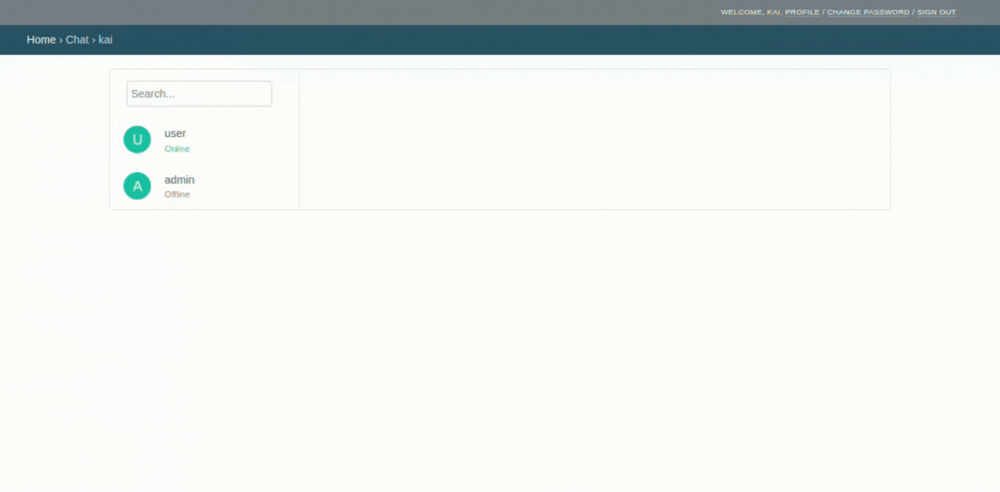

# Django SocketIO Chat
  
  
Simple chat using [python-socketio](https://github.com/miguelgrinberg/python-socketio), 
and using [django-allauth-simple-ui](https://github.com/ThuanD/django-allauth-simple-ui)  
  
## Simple usage
  
Please check the [README.md](https://github.com/ThuanD/django-allauth-simple-ui/blob/main/README.md) to know how to use **django-allauth-simple-ui**
Alternatively, you can check the [testproject](https://github.com/ThuanD/django-socketio-chat/tree/main/testproject) for more details.

1. Install by running the following command
```bash  
pip install django-socketio-chat
```
  
2. Add the following settings to your `settings.py` file
```python
INSTALLED_APPS = [
    "django_socketio_chat",
    # etc
]
ALLAUTH_UI = dict(
    ADAPTER="django_socketio_chat.adapter.CustomUserAdapter",
    # etc
)
```

3. Add the Chat URLs to your `urls.py` file
```python
from django.urls import path, include
urlpatterns = [
   path('chat/', include("django_socketio_chat.urls")),
]
```

4. Config `wsgi.py` to run SocketIO server
```python
import os
import django

os.environ.setdefault('DJANGO_SETTINGS_MODULE', 'testproject.settings')
django.setup()

from socketio import WSGIApp
from django.core.wsgi import get_wsgi_application
from django_socketio_chat.server import ChatServer

application = WSGIApp(ChatServer().sio, get_wsgi_application())
```

5. Collect Static files
```bash
python manage.py collectstatic --no-input
```

6Migrate the database
```bash
python manage.py migrate
```

7. Using wsgi to run the project
```bash
gunicorn testproject.wsgi:application -b 0.0.0.0:8000 -w 1 -k eventlet --reload
```
